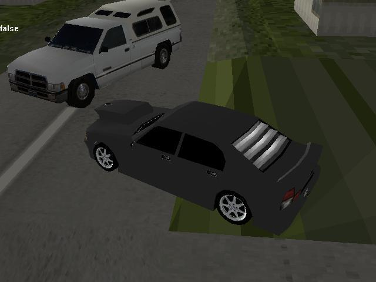



## Gta clone

### Description

This is a clone of Gta. I started working on it 1 year ago. I didn't comment it, but if anyone asks to do so, i will do it with pleasure. Soon i will make much better city and much better collision detection system. The controls are w,a,s,d for your car and up,down,left,right for other car, v to change view, hold p to disable collision.

Rotation of wheels is coming....after you vote.

Please comment, vote and ask.
 
### More Info
 

             |
---                |---
**Submitted On**   |2005-04-24 18:45:14
**By**             |[Evgeny Ohrimenko](https://github.com/Planet-Source-Code/PSCIndex/blob/master/ByAuthor/evgeny-ohrimenko.md)
**Level**          |Advanced
**User Rating**    |4.7 (33 globes from 7 users)
**Compatibility**  |VB 6\.0
**Category**       |[DirectX](https://github.com/Planet-Source-Code/PSCIndex/blob/master/ByCategory/directx__1-44.md)
**World**          |[Visual Basic](https://github.com/Planet-Source-Code/PSCIndex/blob/master/ByWorld/visual-basic.md)
**Archive File**   |[Gta\_clone1880464242005\.zip](https://github.com/Planet-Source-Code/evgeny-ohrimenko-gta-clone__1-60167/archive/master.zip)

